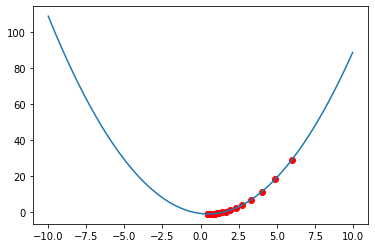

# MultiLayer Perceptron Story

## Perceptron
the perceptron is an algorithm for supervised learning of binary classifiers. A binary classifier is a function which can decide whether or not an input, represented by a vector of numbers, belongs to some specific class.[[1]](https://en.wikipedia.org/wiki/Perceptron)


The Activation Function Used by The Perceptron is **Step Function** it called also **Heaviside Function**.

>Formula of step function 


>graph of step function :


>The Update Rules for The Perceptron are :


> Implementation of The Perceptron :

* [Perceptron](MonoLayerPerceptron.py)

> The Perceptron can separate classes linearly ,In This example we will implement The Perceptron to classify the three problem AND , OR and XOR .


>Each Problem have two classes 0 and 1 .


>This is the representation of each problem that we've :


as you can see in the picture above we've three logic gates AND , OR and XOR . 
as i already say The Perceptron can separate classes linearly , and as you can see we can separate AND , OR with a line but we can't separate the two classes in The XOR by a line .

* AND :


* OR :


* XOR :


> perceptron can't implement XOR. The reason is because the classes in XOR are not linearly separable. You cannot draw a straight line to separate the points (0,0),(1,1) from the points (0,1),(1,0).

> this is why we need more layer  in the network and a different activation function to create the non linearity .

## Mono Layer Perceptron
in this section we will see a Mono Layer perceptron with Log Loss as a cost function :

we use the term log loss for binary classification problems, and the more general cross-entropy for the general case of multi-class classification .

* Log Loss Formula : 


* Cross-entropy Formula : 


### Gradient Descent :
> In This section we will use Gradient Descent as an algorithm for Optimizing our Model :


now let apply the gradient descent to a simple Function to understand how it works :

we will Use This Function : 

The optimal value of this Function is 5 .

The Gradient Descent Update Formula is like bellow : 


```python
#expression of our function :
def f(x):
    return x**2 - x -1
#derivative of our function
def df(x):
    return 2*x - 1

# Gradient Descent 
def gradient(f,df,x0):
    gr = df(x0)
    i = 0
    while i < nbr_iterations and abs(gr) > threashHold:
        x0 -= learning_rate * gr
        gr = df(x0)
        i+=1
    return x0

#Optimizing f(x) = x^2 - x -1

gradient(f, df, 6)
```
 
We get This result , which very good and very close to 5 .



