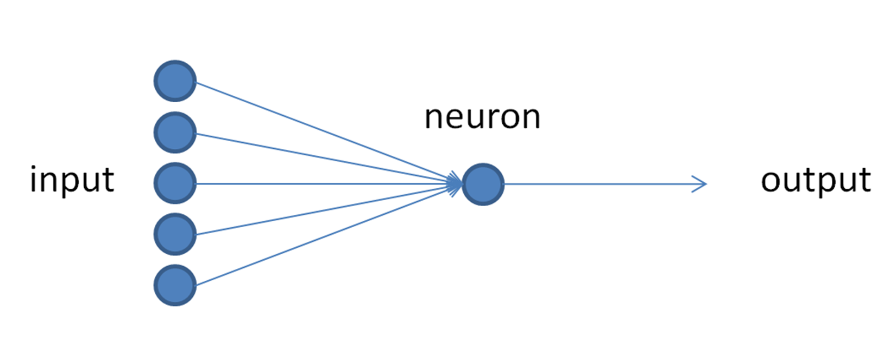
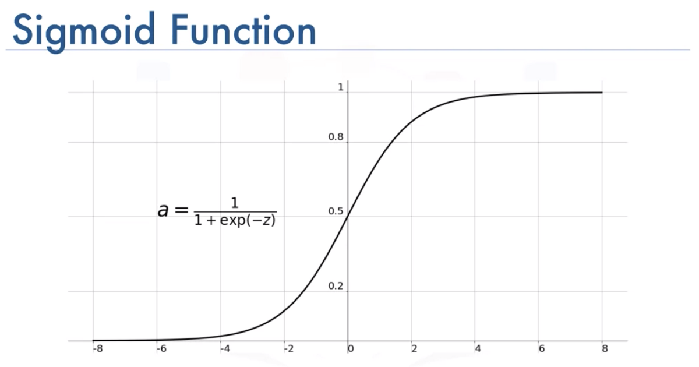

# MultiLayer Perceptron Story

This Repository contains :
* Simple Perceptron .
* limitation of The Perceptron .
* Gradient descent .
* Mono Layer Perceptron with Gradient Descent .
* Multi Layer Perceptron for Binary Classification .
* Multi Layer Perceptron for Multiple Classification .
* Model Evaluation (Confusion Matrix).

---
## Perceptron :
the perceptron is an algorithm for supervised learning of binary classifiers. A binary classifier is a function which can decide whether or not an input, represented by a vector of numbers, belongs to some specific class.[[1]](https://en.wikipedia.org/wiki/Perceptron)

<div align="center" >

</div>

>The Activation Function Used by The Perceptron is **Step Function** it called also **Heaviside Function**.

Formula of step function : 
<div align="center" >

</div>

graph of step function :
<div align="center" >

</div>

The Update Rules for The Perceptron are :
<div align="center" >

</div>

Implementation :
```python
    class Perceptron : 
    
    def __init__(self,learning_rate = 0.1 , number_iter = 1000):
        self.learning_rate = learning_rate
        self.number_iter   = number_iter
        
    
    def fit(self,x,y):
        self.x = x
        self.y = y
    
    
    def initParameters(self , x):
        w = np.random.randn(1,x.shape[1])         
        return w
    
    def heaviside(self,x):
        return 1 if x>= 0 else 0
    
    def heavisideArray(self,x):
        a = [1 if x1>= 0 else 0 for x1 in x[0]]
        return a
    
    def train(self):
        self.w = self.initParameters(self.x)
        
        for i in range(self.number_iter):
            for x , y in zip(self.x , self.y):
                z = np.dot(self.w , x)
                y_hat = self.heaviside(z)
                self.w += self.learning_rate * (y - y_hat) * x
        #self.displayModel()        
                
                
    def predict(self,x):
        z = np.dot(self.w , x)
        a = self.heavisideArray(z)
        return a
    
    def displayModel(self):
        fig , ax = plt.subplots(figsize=(10,7))
        ax.scatter(self.x[:,0] , self.x[:,1] , c = self.y , cmap="bwr")
        x1 = np.linspace(-15,4,100)
        x2 = (-self.w[0][0] * x1 - self.w[0][2]) / self.w[0][1]
        ax.plot(x1,x2 , c='g' , lw=8)
```

> You can find The file here : [Perceptron](Perceptron.py)


The Perceptron can separate classes linearly ,In This example we will implement The Perceptron to classify the three problem AND , OR and XOR .
Each Problem have two classes 0 and 1 .

<div align="center" >

</div>

This is the representation of each problem that we've :

<div align="center" >

</div>


as you can see in the picture above we've three logic gates AND , OR and XOR . 
as i already say The Perceptron can separate classes linearly , and as you can see we can separate AND , OR with a line but we can't separate the two classes in The XOR by a line .

* AND :

<div align="center" >

</div>

* OR :

<div align="center" >

</div>

* XOR :

<div align="center" >

</div>  

perceptron can't implement XOR. The reason is because the classes in XOR are not linearly separable. You cannot draw a straight line to separate the points (0,0),(1,1) from the points (0,1),(1,0).

this is why we need more layer  in the network and a different activation function to create the non linearity .

Implementation :
```python
    # AND Logic circuit 
AND_data = [(np.array([1,1,1]),1),
                 (np.array([1,0,1]),0),
                 (np.array([0,1,1]),0),
                 (np.array([0,0,1]),0)]   

# OR Logic circuit 
OR_data = [(np.array([1,1,1]),1),
                 (np.array([1,0,1]),1),
                 (np.array([0,1,1]),1),
                 (np.array([0,0,1]),0)]

# XOR Logic circuit 
XOR_data = [(np.array([1,1,1]),0),
                 (np.array([1,0,1]),1),
                 (np.array([0,1,1]),1),
                 (np.array([0,0,1]),0)]

def heaviside(x):
   return 1 if x>= 0 else 0

def Perceptron(training_data,circuit):
    w = np.random.rand(3)
    learning_rate = 0.1
    number_iterations = 100        
    
    for i in range(number_iterations):
      x,y = choice(training_data)
      z = x.dot(w)
      y_predicted = heaviside(z)
      w += learning_rate * (y - y_predicted)*x
    
    print(f"Prediction for {circuit} Logic Circuit :  ")
    for x,y in training_data:
      z = x.dot(w)
      y_pred = heaviside(z)
      print(f"x = {x[:2]} , z = {z} , y_pred = {y_pred}")  
    

Perceptron(AND_data, "AND")

Perceptron(OR_data, "OR")

Perceptron(XOR_data, "XOR")
```

> you can find the file here : [logic Gates with Perceptron](logic-circuit.py).
---
## Mono Layer Perceptron :
in this section we will see a Mono Layer perceptron with Log Loss as a cost function :

we use the term log loss for binary classification problems, and the more general cross-entropy for the general case of multi-class classification .

* Log Loss Formula : 

<div align="center" >

</div>


* Cross-entropy Formula : 

<div align="center" >

</div>

---
### Gradient Descent :
In This section we will use Gradient Descent as an algorithm for Optimizing our Model :

<div align="center" >

</div>

now let apply the gradient descent to a simple Function to understand how it works :

we will Use This Function : 

<div align="center" >

</div>

The optimal value of this Function is 5 .

The Gradient Descent Update Formula is like bellow : 

<div align="center" >

</div>

Implementation :
```python
#expression of our function :
def f(x):
    return x**2 - x -1
#derivative of our function
def df(x):
    return 2*x - 1

# Gradient Descent 
def gradient(f,df,x0,learning_rate = 0.1 , nbr_iterations = 100 ,threashHold = 1e-6):
    gr = df(x0)
    i = 0
    while i < nbr_iterations and abs(gr) > threashHold:
        x0 -= learning_rate * gr
        gr = df(x0)
        i+=1
    return x0

#Optimizing f(x) = x^2 - x -1

gradient(f, df, 6)
```
you can find the file here : [Gradient Descent](GradientDescent.py)
 
We get This result , which very good and very close to 5 .

<div align="center" >

</div>

The architecture of our Model is like below :

<div align="center" >

</div>

Model Parameters : 

```
    Z     = w * x + b
    Y_hat = f(z) 
    f is the activation Function .

```

Gradient Descent Update Rules in this case are :

<div align="center" >

</div>

The Activation Function Used in This example is **Sigmoid** :

<div align="center" >

</div>

Implementation :
```python
    def sigmoid(x):
    return 1/(1 + np.exp(-x))

def cross_entropy(y,a):
    return -(y*np.log(a) + (1-y)*np.log(1-a))/y.shape[0]

def initialize_w_b(x):
    w,b = np.random.randn(x.shape[1],1) , np.random.randn(1)
    return w,b
def forward_propagation(x,w,b):
    z = x.dot(w) + b
    a = sigmoid(z)
    return a
def gradients(x,a,y):
    dw , db = np.dot(x.T,a-y) / x.shape[0] , (a-y)/x.shape[0]
    return dw,db

def backward_propagation(x,w,b,a,y,learning_rate):
    dw , db = gradients(x, a, y)
    w , b = w - learning_rate * dw , b - learning_rate *db
    return w,b
def predict(x,w,b):
    a = forward_propagation(x, w, b)
    return a >= 0.5
def perceptron(x,y,learning_rate=0.2,n_iter=1000):
    w,b = initialize_w_b(x)
    
    losses = []
    
    for i in range(n_iter):
        a = forward_propagation(x, w, b)
        loss = cross_entropy(y, a)
        losses.append(loss)
        w , b = backward_propagation(x, w, b, a, y, learning_rate)
        
    y_predicted = predict(x, w, b)

    return y_predicted , losses , w , b

def displayResult(losses):
    fig , ax = plt.subplots()
    x_lim = ax.get_xlim()
    x = np.linspace(x_lim[0] , x_lim[1] , 1000)
    losses = np.sum(losses , axis = 1)
    losses = np.array(losses)
    plt.plot(x , losses)
    plt.show()
````


>you can find the file here : [Mono Layer Perceptron](MonoLayerPerceptron.py)

---
## MultiLayer Perceptron for Binary Classification :

In This Section we will use a MultiLayer Perceptron with this architecture :
<div align="center" >

</div>

Implementation :
```python
class NeuralNetwork:
    
    def __init__(self,x,y,layers,learning_rate,n_iterations):
        self.x = x.T
        self.y = y.reshape((1,y.shape[0]))
        self.layers = layers
        self.learning_rate = learning_rate
        self.n_iterations = n_iterations
        self.params = {}
        for i in range(1,len(self.layers)):
            self.params['w'+str(i)] = np.random.randn(self.layers[i],self.layers[i-1])
            self.params['b'+str(i)] = np.random.randn(self.layers[i],1)
    
    def sigmoid(self,x):
        return 1/(1 + np.exp(-x))
    
    def dsigmoid(self,x):
        return x*(1-x)
    
    def forward_propagation(self,x):
        activations = {'A0':x}
        for i in range(1 , (len(self.params) // 2) +1):
            z = np.dot( self.params['w'+str(i)] , activations['A'+str(i-1)]) + self.params['b'+str(i)]
            activations['A'+str(i)] = self.sigmoid(z)
        return activations
    
    def gradients(self,activations):
        grads = {}
        dz = activations['A'+str(len(self.params) // 2)] -self.y
        for i in reversed(range(1,(len(self.params) // 2)+1)):
            grads['dw'+str(i)] = 1 / self.y.shape[1] * np.dot(dz,activations['A'+str(i-1)].T)
            grads['db'+str(i)] = 1 / self.y.shape[1] * np.sum(dz,axis=1,keepdims=True)
            dz = np.dot(self.params['w'+str(i)].T , dz) * self.dsigmoid(activations['A'+str(i-1)]) 
        return grads
    
    def back_propagation(self,activations):
        grads = self.gradients(activations)
        for i in range(1,len(self.params)//2) :
            self.params['w'+str(i)] -= self.learning_rate * grads['dw'+str(i)]
            self.params['b'+str(i)] -= self.learning_rate * grads['db'+str(i)]
    def train(self):
        for i in range(self.n_iterations):
            activations = self.forward_propagation(self.x)
            self.back_propagation(activations)
        
    def prediction(self,x):
       activations = self.forward_propagation(x)
       return activations['A'+str(len(self.params) // 2)]
        
    def predict(self,x):
       activations = self.forward_propagation(x)
       predictions = activations['A'+str(len(self.params) // 2)]
       for i in range(0,len(predictions[0])):
           if predictions[0,i] > 0.5 :
               predictions[0,i] = 1
           else :
               predictions[0,i] = 0               
       return  predictions
   
    def displayResult(self):
      fig, ax = plt.subplots()
      ax.scatter(self.x[0, :], self.x[1, :], c=self.y, cmap='bwr', s=50)
      x0_lim = ax.get_xlim()
      x1_lim = ax.get_ylim()
    
      resolution = 100
      x0 = np.linspace(x0_lim[0], x0_lim[1], resolution)
      x1 = np.linspace(x1_lim[0], x1_lim[1], resolution)
      X0, X1 = np.meshgrid(x0, x1)
      XX = np.vstack((X0.ravel(), X1.ravel()))
      y_pred = self.prediction(XX)
      y_pred = y_pred.reshape(resolution, resolution)
    
      ax.pcolormesh(X0, X1, y_pred, cmap='bwr',alpha = 0.3 , zorder = -1)
      ax.contour(X0, X1, y_pred, c='g')
      plt.show()

```
You can find the file here : [Mono Layer Perceptron](MultiLayerPerceptronBinaryClassification.py)

> Explanation of the Update Rules :

<div align="center" >

</div>

<div align="center" >

</div>

<div align="center" >

</div>

<div align="center" >

</div>

<div align="center" >

</div>

<div align="center" >

</div>

<div align="center" >

</div>


You can find The PDF here : [Update Rules](resources/explanation/Update-rules.pdf)

---
## MultiLayer Perceptron for Multiple classification :

The difference between MPL Binary classifier and MLP Multiple classifier is in The last Layer of the MLP multiple classifier we used Softmax Activation function instead of sigmoid.

<div align="center" >

</div>

Model Architecture :

<div align="center" >

</div>


Implementation :
```python
    class NeuralNetwork:
    
    def __init__(self,x,y,layers,learning_rate,n_iterations):
        #np.random.seed(0)
        self.x = x.T
        self.y_orig = y
        self.y = LabelBinarizer().fit_transform(y) #to_categorical(y)
        self.y = y.T
        self.layers = layers
        self.learning_rate = learning_rate
        self.n_iterations = n_iterations
        
        
        self.params = {}
        for i in range(1,len(self.layers)):
            self.params['w'+str(i)] = np.random.randn(self.layers[i],self.layers[i-1])
            self.params['b'+str(i)] = np.random.randn(self.layers[i],1)
    
    def sigmoid(self,x):
        return 1/(1 + np.exp(-x))
    
    def dsigmoid(self,x):
        return x*(1-x)
    
    def forward_propagation(self,x):
        activations = {'A0':x}
        L = len(self.params) // 2
        for i in range(1 , L):
            z = np.dot( self.params['w'+str(i)] , activations['A'+str(i-1)]) + self.params['b'+str(i)]
            activations['A'+str(i)] = self.sigmoid(z)
        z = np.dot( self.params['w'+str(L)] , activations['A'+str(L-1)]) + self.params['b'+str(L)]    
        activations['A'+str(L)] = self.softMax(z)
        return activations
     
    def softMax(self,x): 
        return np.exp(x) / np.sum(np.exp(x),axis = 0)
    
    def gradients(self,activations):
        grads = {}
        dz = activations['A'+str(len(self.params) // 2)] - self.y
        for i in reversed(range(1,(len(self.params) // 2)+1)):
            grads['dw'+str(i)] = 1 / self.y.shape[0] * np.dot(dz,activations['A'+str(i-1)].T)
            grads['db'+str(i)] = 1 / self.y.shape[0] * np.sum(dz,axis=1,keepdims=True)
            dz = np.dot(self.params['w'+str(i)].T , dz) * self.dsigmoid(activations['A'+str(i-1)]) 
        return grads
    
    def back_propagation(self,activations):
        grads = self.gradients(activations)
        for i in range(1,len(self.params)//2) :
            self.params['w'+str(i)] -= self.learning_rate * grads['dw'+str(i)]
            self.params['b'+str(i)] -= self.learning_rate * grads['db'+str(i)]
    
    def train(self):
        for i in range(self.n_iterations):
            activations = self.forward_propagation(self.x)
            self.back_propagation(activations)
        
    def prediction(self,x):
       activations = self.forward_propagation(x)
       act = activations['A'+str(len(self.params)//2)]
       return np.argmax(act,axis=0)
        
    def predict(self,x):
       activations = self.forward_propagation(x)
       predictions = activations['A'+str(len(self.params) // 2)]
       for i in range(0,len(predictions[0])):
           if predictions[0,i] > 0.5 :
               predictions[0,i] = 1
           else :
               predictions[0,i] = 0               
       return  predictions
   
    def displayResult(self):
      fig, ax = plt.subplots()
      ax.scatter(self.x[0, :], self.x[1, :], c=self.y_orig, cmap='bwr', s=50)
      x0_lim = ax.get_xlim()
      x1_lim = ax.get_ylim()
    
      resolution = 100
      x0 = np.linspace(x0_lim[0], x0_lim[1], resolution)
      x1 = np.linspace(x1_lim[0], x1_lim[1], resolution)
    
      # meshgrid
      X0, X1 = np.meshgrid(x0, x1)
    
      # assemble (100, 100) -> (10000, 2)
      XX = np.vstack((X0.ravel(), X1.ravel()))
    
      y_pred = self.prediction(XX)
      y_pred = y_pred.reshape(resolution, resolution)
    
      ax.pcolormesh(X0, X1, y_pred, cmap='bwr',alpha = 0.3 , zorder = -1, shading='auto' )
      ax.contour(X0, X1, y_pred, colors='green')
    
      plt.show()

```
you can find The file here : [MultiLayer Perceptron for Multi_classifier](MultiLayerPerceptronMultipleClassification.py)

---
## Model Evaluation (Confusion Matrix) :

A Confusion matrix is an N x N matrix used for evaluating the performance of a classification model, where N is the number of target classes. 

<div align="center" >

</div>

A good model is one which has high **True Positive** and **True Negative** rates, while low **False Positive** and **False Negative** rates.

### Confusion Matrix Elements :

* **True Positives (TP)**: when the actual value is Positive and predicted Value is also Positive.
* **True negatives (TN)**: when the actual value is Negative and predicted Value is also Negative.
* **False positives (FP)**: When the actual Value is negative but predicted Value is Positive. 
* **False negatives (FN)**: When the actual Value is Positive but the predicted Value is Negative.

### Classification Measures :
<div align="center" >

</div>

Calculate The Classification Measures manually :
```python
    from sklearn.metrics import confusion_matrix
    myconfusionMatrix = confusion_matrix(y_test , y_hat)

accuracy = (myconfusionMatrix[0][0] + myconfusionMatrix[1][1]) / np.sum(myconfusionMatrix)
precision = myconfusionMatrix[0][0] / (myconfusionMatrix[0][0] + myconfusionMatrix[0][1])
recall = myconfusionMatrix[0][0] / (myconfusionMatrix[0][0] + myconfusionMatrix[1][0])
specificity = myconfusionMatrix[1][1] / (myconfusionMatrix[1][1] + myconfusionMatrix[0][1])
f1score = 2 * myconfusionMatrix[0][0] / (2 * myconfusionMatrix[0][0] + myconfusionMatrix[1][0] + myconfusionMatrix[0][1])


print(f"Accuracy : {accuracy} .")
print(f"precision : {precision} .")
print(f"recall : {recall} .")
print(f"specificity : {specificity} .")
print(f"f1score : {f1score} .")
```

Calculate The Classification Measures using sklearn  :


```python
    from sklearn.metrics import accuracy_score, precision_score, recall_score, f1_score, fbeta_score


accuracy_score(y_test, y_hat)
precision_score(y_test, y_hat)
recall_score(y_test, y_hat)
f1_score(y_test, y_hat)
fbeta_score(y_test, y_hat,beta=10)
```


